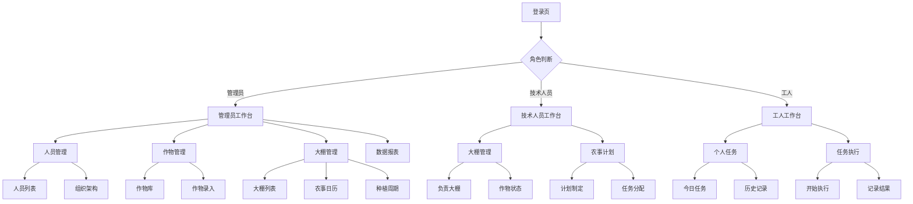

## 1. 产品概述
智慧大棚管理系统是一个专为农业企业设计的数字化管理平台，帮助管理者高效管理大棚种植业务。系统通过数字化手段解决传统农业管理中的信息不透明、计划执行难追踪、人员协调复杂等问题，让农业生产更加科学化、精细化。

目标用户为农业企业管理者、技术人员和普通工人，通过系统化的管理提高农业生产效率和质量。

## 2. 核心功能

### 2.1 用户角色
| 角色 | 注册方式 | 核心权限 |
|------|----------|----------|
| 管理员 | 系统初始化创建 | 管理所有大棚、作物、人员、农事计划 |
| 技术人员 | 管理员分配账号 | 管理分配的大棚、制定农事计划、查看报表 |
| 普通工人 | 管理员/技术人员分配账号 | 执行分配的农事任务、记录执行情况 |

### 2.2 功能模块
智慧大棚管理系统包含以下核心页面：
1. **大棚管理页**：大棚列表、大棚详情、人员分配、作物分配、农事分配、农事日历、种植周期跟踪
2. **作物管理页**：作物库列表、作物信息录入、作物详情查看
3. **农事计划页**：计划制定、每日任务、执行记录、任务类型管理
4. **人员管理页**：人员列表、人员信息录入、组织架构管理、权限分配
5. **工作台页**：个人任务列表、待办事项、执行记录
6. **数据报表页**：生产统计、效率分析、成本分析

### 2.3 页面详情
| 页面名称 | 模块名称 | 功能描述 |
|----------|----------|----------|
| 大棚管理页 | 大棚列表 | 显示所有大棚的基本信息（编号、名称、位置、状态），支持搜索、筛选、排序 |
| 大棚管理页 | 大棚详情 | 显示大棚详细信息（规格、建设时间、设备配置），支持编辑基本信息 |
| 大棚管理页 | 人员分配 | 为大棚分配管理人员和技术人员，设置主要职责和联系方式 |
| 大棚管理页 | 作物分配 | 选择作物品种，设置种植面积、种植时间、预计收获时间 |
| 大棚管理页 | 农事分配 | 根据作物生长阶段自动推荐农事任务，支持手动调整任务安排 |
| 大棚管理页 | 农事日历 | 以日历形式展示大棚的所有农事计划，支持月视图、周视图切换 |
| 大棚管理页 | 种植周期 | 跟踪作物从种植到收获的完整周期，显示当前生长阶段和预计时间 |
| 作物管理页 | 作物库列表 | 展示系统支持的所有作物品种，支持按类别、生长周期筛选 |
| 作物管理页 | 作物信息录入 | 录入作物基本信息（名称、类别、品种、图片）、生长阶段定义、环境要求 |
| 作物管理页 | 作物详情 | 显示作物完整信息，包括种植指南、病虫害防治、施肥建议 |
| 农事计划页 | 计划制定 | 选择大棚和时间段，制定详细的农事计划，设置任务优先级 |
| 农事计划页 | 每日任务 | 显示当天所有大棚的农事任务，按紧急程度排序 |
| 农事计划页 | 执行记录 | 记录每项农事任务的实际执行情况，包括执行人、时间、用量、照片 |
| 农事计划页 | 任务类型管理 | 定义不同类型的农事任务（灌溉、施肥、除草、病虫害防治、采收等） |
| 人员管理页 | 人员列表 | 显示企业所有人员信息，支持按部门、职位、技能筛选 |
| 人员管理页 | 人员信息录入 | 录入人员基本信息（姓名、联系方式、技能特长）、工作经历、培训记录 |
| 人员管理页 | 组织架构 | 建立企业组织架构，设置上下级关系和职责分工 |
| 人员管理页 | 权限分配 | 为不同角色分配系统操作权限，控制数据访问范围 |
| 工作台页 | 个人任务 | 显示当前登录用户的待办任务和已完成的任务 |
| 工作台页 | 任务执行 | 选择任务进行执行，记录执行过程和结果 |
| 数据报表页 | 生产统计 | 统计各大棚的种植面积、产量、产值等关键指标 |
| 数据报表页 | 效率分析 | 分析人员工作效率、任务完成率、时间利用率 |
| 数据报表页 | 成本分析 | 统计农资投入成本、人工成本、设备折旧等 |

## 3. 核心流程
### 管理员流程
1. 登录系统 → 进入人员管理 → 添加企业人员信息 → 设置组织架构和权限
2. 进入作物管理 → 录入企业种植作物信息 → 设置生长阶段和环境要求
3. 进入大棚管理 → 录入大棚基本信息 → 分配管理人员和技术人员
4. 为大棚分配种植作物 → 系统自动生成农事计划 → 手动调整优化计划
5. 查看农事日历 → 监控任务执行情况 → 查看数据报表分析

### 技术人员流程
1. 登录系统 → 查看个人工作台 → 查看负责的大棚列表
2. 进入大棚详情 → 查看作物生长状态 → 调整农事计划
3. 查看每日任务 → 分配给具体工人 → 跟踪执行进度
4. 记录异常情况 → 调整管理措施 → 更新作物状态

### 普通工人流程
1. 登录系统 → 查看个人工作台 → 查看今日任务列表
2. 选择待办任务 → 查看任务详情和要求 → 开始执行任务
3. 记录执行过程 → 拍照记录 → 填写执行结果
4. 标记任务完成 → 查看下一个任务

## 4. 用户界面设计
### 4.1 设计风格
- **主色调**：绿色系（#2E7D32主色，#4CAF50辅色），体现农业特色
- **按钮样式**：圆角矩形，主按钮使用渐变色，次要按钮使用边框样式
- **字体**：中文使用思源黑体，英文使用Roboto，正文字号14px，标题字号18-24px
- **布局风格**：左侧导航栏+右侧内容区的经典管理后台布局，卡片式设计展示数据
- **图标风格**：使用线性图标，简洁明了，符合农业主题

### 4.2 页面设计概述
| 页面名称 | 模块名称 | UI元素 |
|----------|----------|--------|
| 登录页 | 登录表单 | 居中卡片布局，绿色渐变背景，包含用户名、密码输入框和登录按钮 |
| 工作台 | 任务卡片 | 网格布局展示任务卡片，包含任务名称、截止时间、优先级标识 |
| 大棚列表 | 大棚卡片 | 卡片式展示大棚缩略图、名称、状态指示灯，支持拖拽排序 |
| 农事日历 | 日历视图 | 月视图和周视图切换，不同任务类型用颜色区分，支持点击查看详情 |
| 人员列表 | 人员卡片 | 头像+姓名+职位+联系方式的紧凑卡片布局，支持快速搜索 |
| 数据报表 | 图表展示 | 使用柱状图、饼图、折线图等多种图表形式展示统计数据 |

### 4.3 响应式设计
- **桌面端优先**：主要面向PC端用户设计，充分利用大屏幕空间
- **平板适配**：支持平板设备访问，优化触摸操作体验
- **移动端简化**：提供移动端Web版本，核心功能可用，简化复杂操作

### 4.4 交互设计
- **拖拽操作**：支持大棚排序、任务优先级调整等拖拽交互
- **批量操作**：提供批量选择、批量分配、批量导出等功能
- **实时提醒**：任务到期提醒、异常报警等实时通知
- **快捷操作**：右键菜单、快捷键等提高操作效率