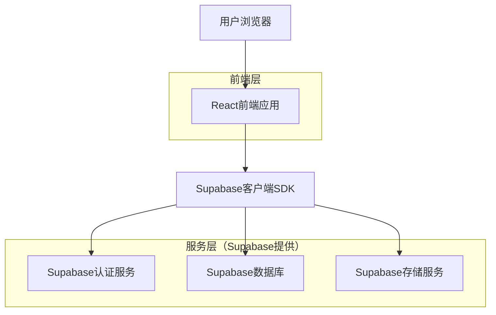
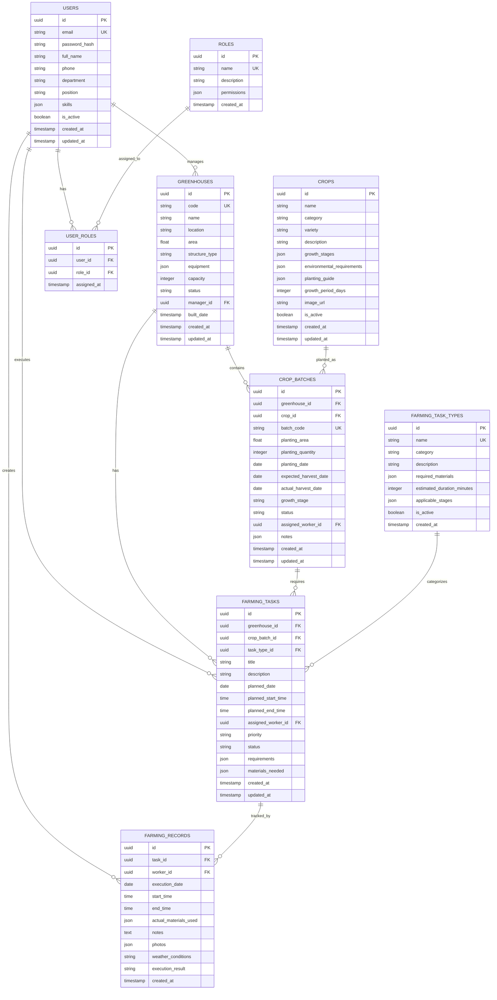

## 1. 架构设计



## 2. 技术描述

- **前端**: React@18 + TypeScript + TailwindCSS@3 + Vite
- **初始化工具**: Vite-init
- **后端服务**: Supabase（BaaS平台）
- **UI组件库**: Ant Design@5
- **状态管理**: React Context + useReducer
- **图表库**: ECharts@5
- **日期处理**: Dayjs
- **富文本编辑器**: React-Quill

## 3. 路由定义

| 路由 | 用途 |
|------|------|
| / | 登录页面，用户身份验证 |
| /dashboard | 工作台首页，显示个人任务概览 |
| /greenhouses | 大棚管理页面，大棚列表和详情 |
| /greenhouses/:id | 具体大棚详情页面 |
| /greenhouses/:id/calendar | 大棚农事日历页面 |
| /crops | 作物管理页面，作物库列表 |
| /crops/new | 新增作物页面 |
| /crops/:id | 作物详情页面 |
| /farming-plans | 农事计划管理页面 |
| /farming-plans/daily | 每日任务页面 |
| /farming-records | 农事记录页面 |
| /personnel | 人员管理页面 |
| /personnel/new | 新增人员页面 |
| /personnel/:id | 人员详情页面 |
| /reports | 数据报表页面 |
| /profile | 个人资料页面 |

## 4. 数据模型

### 4.1 核心数据模型



### 4.2 数据定义语言

```sql
-- 用户表
CREATE TABLE users (
  id UUID PRIMARY KEY DEFAULT gen_random_uuid(),
  email VARCHAR(255) UNIQUE NOT NULL,
  password_hash VARCHAR(255) NOT NULL,
  full_name VARCHAR(100) NOT NULL,
  phone VARCHAR(20),
  department VARCHAR(50),
  position VARCHAR(50),
  skills JSONB DEFAULT '[]',
  is_active BOOLEAN DEFAULT true,
  created_at TIMESTAMP WITH TIME ZONE DEFAULT NOW(),
  updated_at TIMESTAMP WITH TIME ZONE DEFAULT NOW()
);

-- 角色表
CREATE TABLE roles (
  id UUID PRIMARY KEY DEFAULT gen_random_uuid(),
  name VARCHAR(50) UNIQUE NOT NULL,
  description TEXT,
  permissions JSONB DEFAULT '[]',
  created_at TIMESTAMP WITH TIME ZONE DEFAULT NOW()
);

-- 用户角色关联表
CREATE TABLE user_roles (
  id UUID PRIMARY KEY DEFAULT gen_random_uuid(),
  user_id UUID REFERENCES users(id) ON DELETE CASCADE,
  role_id UUID REFERENCES roles(id) ON DELETE CASCADE,
  assigned_at TIMESTAMP WITH TIME ZONE DEFAULT NOW(),
  UNIQUE(user_id, role_id)
);

-- 大棚表
CREATE TABLE greenhouses (
  id UUID PRIMARY KEY DEFAULT gen_random_uuid(),
  code VARCHAR(20) UNIQUE NOT NULL,
  name VARCHAR(100) NOT NULL,
  location VARCHAR(255),
  area DECIMAL(10,2),
  structure_type VARCHAR(50),
  equipment JSONB DEFAULT '{}',
  capacity INTEGER,
  status VARCHAR(20) DEFAULT 'active',
  manager_id UUID REFERENCES users(id),
  built_date DATE,
  created_at TIMESTAMP WITH TIME ZONE DEFAULT NOW(),
  updated_at TIMESTAMP WITH TIME ZONE DEFAULT NOW()
);

-- 作物表
CREATE TABLE crops (
  id UUID PRIMARY KEY DEFAULT gen_random_uuid(),
  name VARCHAR(100) NOT NULL,
  category VARCHAR(50) NOT NULL,
  variety VARCHAR(100),
  description TEXT,
  growth_stages JSONB DEFAULT '[]',
  environmental_requirements JSONB DEFAULT '{}',
  planting_guide TEXT,
  growth_period_days INTEGER,
  image_url TEXT,
  is_active BOOLEAN DEFAULT true,
  created_at TIMESTAMP WITH TIME ZONE DEFAULT NOW(),
  updated_at TIMESTAMP WITH TIME ZONE DEFAULT NOW()
);

-- 作物批次表
CREATE TABLE crop_batches (
  id UUID PRIMARY KEY DEFAULT gen_random_uuid(),
  greenhouse_id UUID REFERENCES greenhouses(id) ON DELETE CASCADE,
  crop_id UUID REFERENCES crops(id) ON DELETE CASCADE,
  batch_code VARCHAR(50) UNIQUE NOT NULL,
  planting_area DECIMAL(10,2),
  planting_quantity INTEGER,
  planting_date DATE NOT NULL,
  expected_harvest_date DATE,
  actual_harvest_date DATE,
  growth_stage VARCHAR(50),
  status VARCHAR(20) DEFAULT 'growing',
  assigned_worker_id UUID REFERENCES users(id),
  notes JSONB DEFAULT '{}',
  created_at TIMESTAMP WITH TIME ZONE DEFAULT NOW(),
  updated_at TIMESTAMP WITH TIME ZONE DEFAULT NOW()
);

-- 农事任务类型表
CREATE TABLE farming_task_types (
  id UUID PRIMARY KEY DEFAULT gen_random_uuid(),
  name VARCHAR(100) UNIQUE NOT NULL,
  category VARCHAR(50) NOT NULL,
  description TEXT,
  required_materials JSONB DEFAULT '[]',
  estimated_duration_minutes INTEGER,
  applicable_stages JSONB DEFAULT '[]',
  is_active BOOLEAN DEFAULT true,
  created_at TIMESTAMP WITH TIME ZONE DEFAULT NOW()
);

-- 农事任务表
CREATE TABLE farming_tasks (
  id UUID PRIMARY KEY DEFAULT gen_random_uuid(),
  greenhouse_id UUID REFERENCES greenhouses(id) ON DELETE CASCADE,
  crop_batch_id UUID REFERENCES crop_batches(id) ON DELETE CASCADE,
  task_type_id UUID REFERENCES farming_task_types(id),
  title VARCHAR(200) NOT NULL,
  description TEXT,
  planned_date DATE NOT NULL,
  planned_start_time TIME,
  planned_end_time TIME,
  assigned_worker_id UUID REFERENCES users(id),
  priority VARCHAR(20) DEFAULT 'medium',
  status VARCHAR(20) DEFAULT 'pending',
  requirements JSONB DEFAULT '{}',
  materials_needed JSONB DEFAULT '[]',
  created_at TIMESTAMP WITH TIME ZONE DEFAULT NOW(),
  updated_at TIMESTAMP WITH TIME ZONE DEFAULT NOW()
);

-- 农事记录表
CREATE TABLE farming_records (
  id UUID PRIMARY KEY DEFAULT gen_random_uuid(),
  task_id UUID REFERENCES farming_tasks(id) ON DELETE CASCADE,
  worker_id UUID REFERENCES users(id),
  execution_date DATE NOT NULL,
  start_time TIME,
  end_time TIME,
  actual_materials_used JSONB DEFAULT '[]',
  notes TEXT,
  photos JSONB DEFAULT '[]',
  weather_conditions VARCHAR(100),
  execution_result VARCHAR(50),
  created_at TIMESTAMP WITH TIME ZONE DEFAULT NOW()
);

-- 创建索引
CREATE INDEX idx_users_email ON users(email);
CREATE INDEX idx_users_is_active ON users(is_active);
CREATE INDEX idx_greenhouses_manager_id ON greenhouses(manager_id);
CREATE INDEX idx_crop_batches_greenhouse_id ON crop_batches(greenhouse_id);
CREATE INDEX idx_crop_batches_crop_id ON crop_batches(crop_id);
CREATE INDEX idx_crop_batches_status ON crop_batches(status);
CREATE INDEX idx_farming_tasks_greenhouse_id ON farming_tasks(greenhouse_id);
CREATE INDEX idx_farming_tasks_crop_batch_id ON farming_tasks(crop_batch_id);
CREATE INDEX idx_farming_tasks_assigned_worker_id ON farming_tasks(assigned_worker_id);
CREATE INDEX idx_farming_tasks_planned_date ON farming_tasks(planned_date);
CREATE INDEX idx_farming_tasks_status ON farming_tasks(status);
CREATE INDEX idx_farming_records_task_id ON farming_records(task_id);
CREATE INDEX idx_farming_records_worker_id ON farming_records(worker_id);
CREATE INDEX idx_farming_records_execution_date ON farming_records(execution_date);

-- 初始化数据
INSERT INTO roles (name, description, permissions) VALUES
('admin', '系统管理员', '["manage_users", "manage_roles", "manage_greenhouses", "manage_crops", "manage_farming", "view_reports"]'),
('manager', '大棚管理员', '["manage_greenhouses", "manage_crops", "manage_farming", "view_reports"]'),
('technician', '技术人员', '["view_assigned_greenhouses", "manage_farming", "view_reports"]'),
('worker', '普通工人', '["view_assigned_tasks", "execute_tasks", "view_own_records"]');

INSERT INTO farming_task_types (name, category, description, required_materials, estimated_duration_minutes, applicable_stages) VALUES
('播种', '种植', '将种子播撒到土壤中', '[{"name": "种子", "unit": "粒"}, {"name": "土壤", "unit": "kg"}]', 60, '["preparation"]'),
('灌溉', '养护', '给作物补充水分', '[{"name": "水", "unit": "L"}]', 30, '["growing", "flowering", "fruiting"]'),
('施肥', '养护', '给作物补充营养', '[{"name": "肥料", "unit": "kg"}]', 45, '["growing", "flowering", "fruiting"]'),
('除草', '养护', '清除杂草', '[{"name": "除草工具", "unit": "件"}]', 90, '["growing"]'),
('病虫害防治', '保护', '预防和治疗病虫害', '[{"name": "农药", "unit": "L"}, {"name": "喷雾器", "unit": "台"}]', 60, '["growing", "flowering"]'),
('采收', '收获', '收获成熟的作物', '[{"name": "采收工具", "unit": "件"}, {"name": "包装箱", "unit": "个"}]', 120, '["harvest"]');
```

## 5. API定义

### 5.1 认证相关API

#### 用户登录
```
POST /api/auth/login
```

请求参数：
| 参数名 | 类型 | 必填 | 描述 |
|--------|------|------|------|
| email | string | 是 | 用户邮箱 |
| password | string | 是 | 用户密码 |

响应参数：
| 参数名 | 类型 | 描述 |
|--------|------|------|
| user | object | 用户信息 |
| token | string | 访问令牌 |
| refresh_token | string | 刷新令牌 |

#### 用户登出
```
POST /api/auth/logout
```

#### 获取当前用户信息
```
GET /api/auth/me
```

### 5.2 大棚管理API

#### 获取大棚列表
```
GET /api/greenhouses
```

查询参数：
| 参数名 | 类型 | 描述 |
|--------|------|------|
| page | number | 页码 |
| limit | number | 每页数量 |
| status | string | 状态筛选 |
| manager_id | string | 管理员筛选 |

#### 创建大棚
```
POST /api/greenhouses
```

请求体：
| 参数名 | 类型 | 必填 | 描述 |
|--------|------|------|------|
| code | string | 是 | 大棚编号 |
| name | string | 是 | 大棚名称 |
| location | string | 是 | 位置 |
| area | number | 是 | 面积 |
| structure_type | string | 否 | 结构类型 |
| capacity | number | 否 | 容量 |
| manager_id | string | 是 | 管理员ID |

#### 更新大棚信息
```
PUT /api/greenhouses/:id
```

#### 删除大棚
```
DELETE /api/greenhouses/:id
```

#### 分配人员到大棚
```
POST /api/greenhouses/:id/assign-personnel
```

请求体：
| 参数名 | 类型 | 描述 |
|--------|------|------|
| user_ids | array | 用户ID数组 |
| role_type | string | 角色类型 |

#### 分配作物到大棚
```
POST /api/greenhouses/:id/assign-crop
```

请求体：
| 参数名 | 类型 | 描述 |
|--------|------|------|
| crop_id | string | 作物ID |
| planting_area | number | 种植面积 |
| planting_quantity | number | 种植数量 |
| planting_date | string | 种植日期 |

#### 获取大棚农事日历
```
GET /api/greenhouses/:id/calendar
```

查询参数：
| 参数名 | 类型 | 描述 |
|--------|------|------|
| start_date | string | 开始日期 |
| end_date | string | 结束日期 |
| view_type | string | 视图类型（month/week） |

### 5.3 作物管理API

#### 获取作物列表
```
GET /api/crops
```

#### 创建作物
```
POST /api/crops
```

请求体：
| 参数名 | 类型 | 描述 |
|--------|------|------|
| name | string | 作物名称 |
| category | string | 作物类别 |
| variety | string | 品种 |
| description | string | 描述 |
| growth_stages | array | 生长阶段 |
| environmental_requirements | object | 环境要求 |
| growth_period_days | number | 生长周期天数 |

#### 更新作物信息
```
PUT /api/crops/:id
```

#### 删除作物
```
DELETE /api/crops/:id
```

### 5.4 农事计划API

#### 获取农事任务列表
```
GET /api/farming-tasks
```

查询参数：
| 参数名 | 类型 | 描述 |
|--------|------|------|
| greenhouse_id | string | 大棚ID |
| planned_date | string | 计划日期 |
| status | string | 任务状态 |
| assigned_worker_id | string | 分配工人ID |

#### 创建农事任务
```
POST /api/farming-tasks
```

请求体：
| 参数名 | 类型 | 描述 |
|--------|------|------|
| greenhouse_id | string | 大棚ID |
| crop_batch_id | string | 作物批次ID |
| task_type_id | string | 任务类型ID |
| title | string | 任务标题 |
| description | string | 任务描述 |
| planned_date | string | 计划日期 |
| planned_start_time | string | 计划开始时间 |
| planned_end_time | string | 计划结束时间 |
| assigned_worker_id | string | 分配工人ID |
| priority | string | 优先级 |

#### 更新农事任务
```
PUT /api/farming-tasks/:id
```

#### 获取每日任务
```
GET /api/farming-tasks/daily/:date
```

#### 获取任务类型列表
```
GET /api/farming-task-types
```

### 5.5 农事记录API

#### 创建农事记录
```
POST /api/farming-records
```

请求体：
| 参数名 | 类型 | 描述 |
|--------|------|------|
| task_id | string | 任务ID |
| execution_date | string | 执行日期 |
| start_time | string | 开始时间 |
| end_time | string | 结束时间 |
| actual_materials_used | array | 实际使用材料 |
| notes | string | 备注 |
| photos | array | 照片URLs |
| weather_conditions | string | 天气条件 |
| execution_result | string | 执行结果 |

#### 获取农事记录列表
```
GET /api/farming-records
```

#### 获取个人执行记录
```
GET /api/farming-records/my-records
```

### 5.6 人员管理API

#### 获取人员列表
```
GET /api/users
```

查询参数：
| 参数名 | 类型 | 描述 |
|--------|------|------|
| department | string | 部门筛选 |
| position | string | 职位筛选 |
| is_active | boolean | 状态筛选 |

#### 创建用户
```
POST /api/users
```

#### 更新用户信息
```
PUT /api/users/:id
```

#### 分配角色
```
POST /api/users/:id/assign-role
```

### 5.7 数据报表API

#### 获取生产统计
```
GET /api/reports/production
```

查询参数：
| 参数名 | 类型 | 描述 |
|--------|------|------|
| start_date | string | 开始日期 |
| end_date | string | 结束日期 |
| greenhouse_id | string | 大棚ID |

#### 获取效率分析
```
GET /api/reports/efficiency
```

#### 获取成本分析
```
GET /api/reports/cost
```

## 6. 权限设计

### 6.1 角色权限矩阵

| 功能模块 | 管理员 | 大棚管理员 | 技术人员 | 普通工人 |
|----------|--------|------------|----------|----------|
| 用户管理 | 全部权限 | 查看 | 无 | 无 |
| 大棚管理 | 全部权限 | 全部权限 | 查看分配的大棚 | 无 |
| 作物管理 | 全部权限 | 全部权限 | 查看 | 无 |
| 农事计划 | 全部权限 | 全部权限 | 管理分配大棚的计划 | 查看分配的任务 |
| 农事记录 | 全部权限 | 全部权限 | 查看分配大棚的记录 | 管理个人记录 |
| 数据报表 | 全部权限 | 查看 | 查看 | 无 |

### 6.2 Supabase RLS策略

```sql
-- 用户表RLS策略
ALTER TABLE users ENABLE ROW LEVEL SECURITY;

-- 管理员可以查看所有用户
CREATE POLICY "Admins can view all users" ON users
  FOR SELECT USING (
    EXISTS (
      SELECT 1 FROM user_roles ur
      JOIN roles r ON ur.role_id = r.id
      WHERE ur.user_id = auth.uid() AND r.name = 'admin'
    )
  );

-- 用户只能查看自己的信息
CREATE POLICY "Users can view own profile" ON users
  FOR SELECT USING (id = auth.uid());

-- 大棚表RLS策略
ALTER TABLE greenhouses ENABLE ROW LEVEL SECURITY;

-- 管理员和管理员可以管理所有大棚
CREATE POLICY "Admins and managers can manage all greenhouses" ON greenhouses
  FOR ALL USING (
    EXISTS (
      SELECT 1 FROM user_roles ur
      JOIN roles r ON ur.role_id = r.id
      WHERE ur.user_id = auth.uid() AND r.name IN ('admin', 'manager')
    )
  );

-- 技术人员可以查看分配的大棚
CREATE POLICY "Technicians can view assigned greenhouses" ON greenhouses
  FOR SELECT USING (
    EXISTS (
      SELECT 1 FROM user_roles ur
      JOIN roles r ON ur.role_id = r.id
      WHERE ur.user_id = auth.uid() AND r.name = 'technician'
      AND (manager_id = auth.uid() OR id IN (
        SELECT greenhouse_id FROM crop_batches WHERE assigned_worker_id = auth.uid()
      ))
    )
  );

-- 农事任务表RLS策略
ALTER TABLE farming_tasks ENABLE ROW LEVEL SECURITY;

-- 工人只能查看分配给自己的任务
CREATE POLICY "Workers can view assigned tasks" ON farming_tasks
  FOR SELECT USING (
    assigned_worker_id = auth.uid() OR 
    EXISTS (
      SELECT 1 FROM user_roles ur
      JOIN roles r ON ur.role_id = r.id
      WHERE ur.user_id = auth.uid() AND r.name IN ('admin', 'manager', 'technician')
    )
  );

-- 授予权限
GRANT SELECT ON users TO anon;
GRANT ALL ON users TO authenticated;
GRANT SELECT ON greenhouses TO anon;
GRANT ALL ON greenhouses TO authenticated;
GRANT SELECT ON crops TO anon;
GRANT ALL ON crops TO authenticated;
GRANT SELECT ON farming_tasks TO anon;
GRANT ALL ON farming_tasks TO authenticated;
GRANT SELECT ON farming_records TO anon;
GRANT ALL ON farming_records TO authenticated;
```